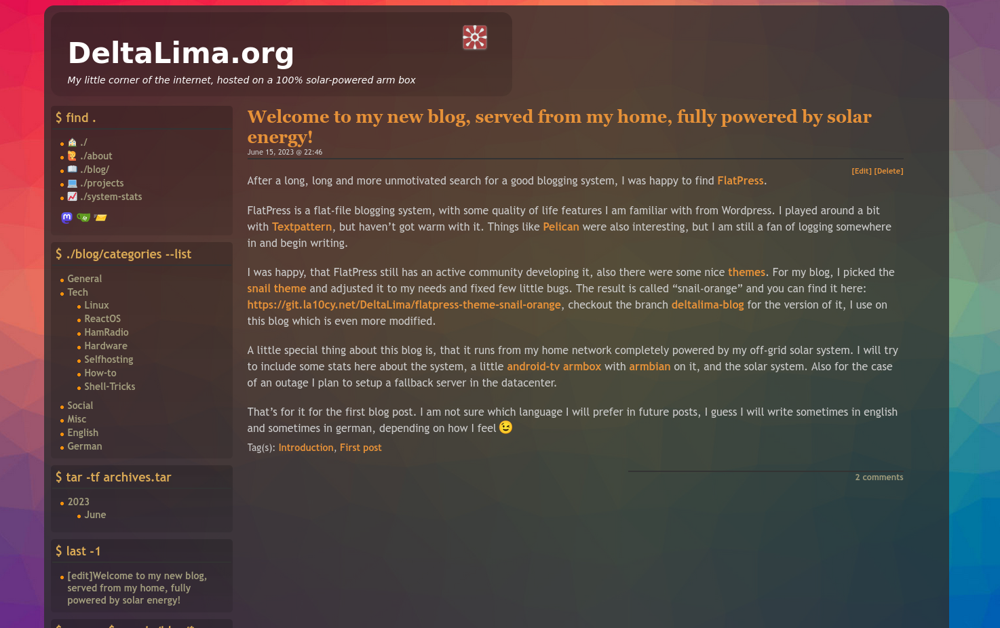

# flatpress-theme-rainbow

Origin: https://git.la10cy.net/DeltaLima/flatpress-theme-rainbow

Rainbow theme for [FlatPress](flatpress.org) I stole the colorful background from https://websitesetup.org/bootstrap-tutorial-for-beginners/ :)

forked from https://wiki.flatpress.org/res:themes:snail

## Known issue

Actually (26.06.2023) I dont know why, I havent looked for it, but when have comments on a blog post, the footer is also a Link pointing to the comments section.
